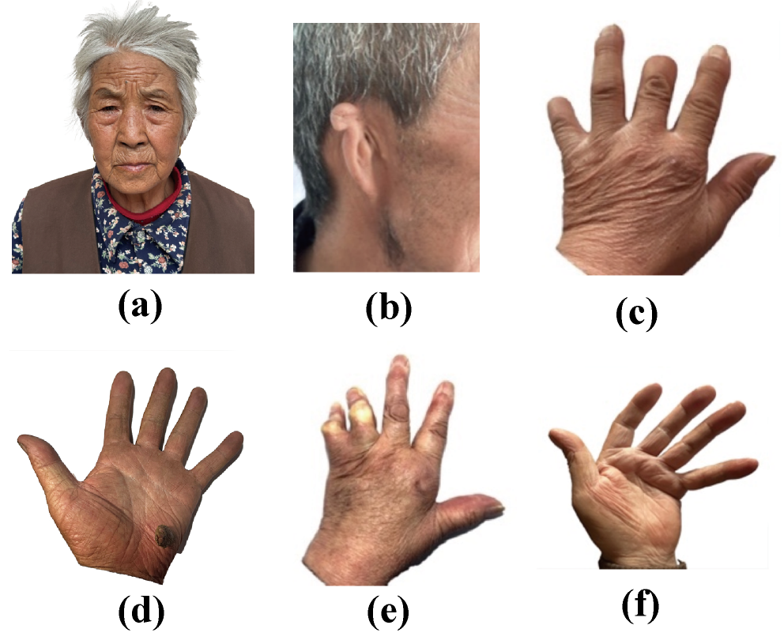
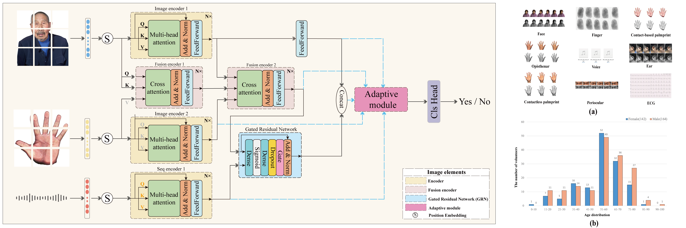

# Authformer: adaptive multimodal biometric authentication transformer

## News
### 🥸 Our paper has been submitted to the ICME conference. Wish us good luck! 🍀🍀🍀
### 🤩 We have uploaded part of the code, and the complete training and fine-tuning code will be made publicly available after the paper is published.
### 🤩 The conference has returned the reviews. We sincerely thank the reviewers for their effort and time.❤️❤️❤️ 

### 🦾 To help you better understand, I have provided examples of special population cases. These include: a. A 79-year-old mute individual, b. An individual with right ear injury and deformation, c. A person with missing fingers, d. A person with a palm tumor, e. An individual with deformed finger joints, f. A person with rheumatoid arthritis requiring contactless palmprints.

## Overview

AuthFormer is an adaptive multimodal biometric authentication Transformer specifically designed for middle-aged and elderly populations. It integrates innovative techniques, including cross-attention mechanisms and Gated Residual Networks (GRN), to enhance adaptability, security, and robustness. The framework supports dynamic combinations and varying numbers of biometric modalities, enabling practical deployment in real-world environments.

## Features

- Multimodal Fusion: Combines multiple biometric modalities (e.g., voice, face, fingerprint) using cross-attention mechanisms.
- Gated Residual Network (GRN): Incorporates a gating mechanism to selectively enhance key features during fusion.
- Adaptive Capability: Adjusts dynamically to different biometric modality combinations and quantities.
- High Accuracy: Achieves up to 99.73% accuracy on the LUTBIO database with three modalities.
- Low Complexity: Requires only two encoder layers to achieve optimal performance.

## Installation

### Prerequisites

- Python 3.8+
- PyTorch 2.0.0+cu118
- TorchVision 0.15.1+cu118

## datasets
AuthFormer is **validated** on two publicly available multimodal biometric databases. We have uploaded sample files of the datasets. Please check the data folder for more details.

## Experimental Results

### Comparative Study

AuthFormer outperforms state-of-the-art models across multiple metrics:

| Model                | Accuracy | Macro Recall | Macro F1  |
|----------------------|----------|--------------|-----------|
| AuthFormer           | 0.9973   | 0.9972       | 0.9977    |
| ViT (Face Only)      | 0.9724   | 0.9752       | 0.9733    |
| GRU (Voice Only)     | 0.5915   | 0.5915       | 0.5859    |
| MobileNet (Face Only)| 0.9235   | 0.9233       | 0.9235    |

### Hyperparameters

| Hyperparameter           | Value              |
|--------------------------|--------------------|
| Initial Learning Rate    | 0.001             |
| Learning Rate Decay      | Cosine Annealing  |
| Optimizer                | AdamW             |
| Epochs                   | 100               |
| Dropout                  | 0.2               |
| Embedding Dimension      | 512               |
| Number of Attention Heads| 32                |

## For additional questions or contributions, please open an issue or submit a pull request.
